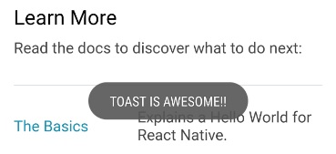

# Toast

android: api 21+  
ios : 10.0+  
web: +  



## Getting started

`$ npm install react-native-toastview --save`  
`$ react-native link react-native-toastview`  
  
or

`$ yarn add react-native-toastview `
    

# Usage

duration:

```swift
Toast.short   
Toast.long    

```

```javascript
import Toast from 'react-native-toastview'

<touchableView onPress={()=>{
    Toast.show("mymessage",Toast.SHORT)
}} 
 />
```